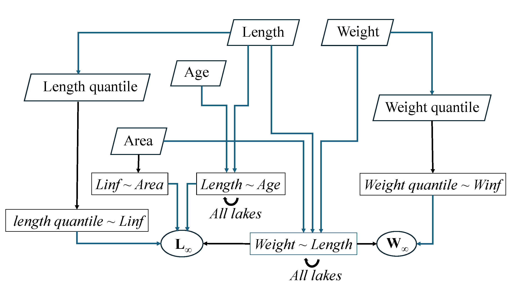

```{r setup, include=FALSE}
knitr::opts_chunk$set(echo = FALSE, dpi=300)
```

```{r LoadSample}
# loading data to report sample sizes
load(file="Rdata/laketrout_sampling_formodel.Rdata")
library(magrittr)
library(jagshelper)

roundn <- paste0(formatC(round(nrow(laketrout), digits=-4), 
                         big.mark=",", format="f", digits=0), 
                 "+")
nw <- sum(!is.na(laketrout$Weight_g)) %>% 
  formatC(big.mark=",", format="f", digits=0)
nl <- sum(!is.na(laketrout$ForkLength_mm)) %>% 
  formatC(big.mark=",", format="f", digits=0)
na <- sum(!is.na(laketrout$Age)) %>% 
  formatC(big.mark=",", format="f", digits=0)

nlw <- sum(!is.na(laketrout$ForkLength_mm & laketrout$Weight_g)) %>% 
  formatC(big.mark=",", format="f", digits=0)
nla <- sum(!is.na(laketrout$ForkLength_mm & laketrout$Age)) %>% 
  formatC(big.mark=",", format="f", digits=0)

nllw <- length(unique(laketrout$LakeName[!is.na(laketrout$ForkLength_mm & laketrout$Weight_g)]))
nlla <- length(unique(laketrout$LakeName[!is.na(laketrout$ForkLength_mm & laketrout$Age)]))

nlakes <- length(unique(laketrout$LakeName))
```

```{r LoadModelResults}
## loading the JAGS output itself (this is a big file)
load(file="interim_posts/int_Winf_modelrun.Rdata")

# ^^^^^ update this file with non-interim model run ^^^^^

```


```{r make_nmat}
ff <- function(x, n=nrow(laketrout_Winf)) { # f for fill
  c(x, rep(NA, n - length(x)))
}

smallernames <- lakenames %>%
  strsplit(split = " Lake") %>%
  sapply("[", 1)
smallernames[lakenames == "Caribou Lake (Cantwell)"] <- "Caribou (Cantwell)"
smallernames[lakenames == "Caribou Lake (Lake Louise)"] <- "Caribou (Lake Louise)"
smallernames[lakenames == "Itkillik lake"] <- "Itkillik"
smallernames[lakenames == "Little Lake Louise"] <- "Little Louise"
smallernames[lakenames == "Sevenmile Lake (Denali Hwy)"] <- "Sevenmile (Denali Hwy)"

nL <- tapply(!is.na(int_Winf_data$L), int_Winf_data$lake, sum)
nW <- tapply(!is.na(int_Winf_data$logW), int_Winf_data$lake, sum)
nA <- tapply(!is.na(int_Winf_data$Age), int_Winf_data$lake, sum)
nLW <- tapply(!is.na(int_Winf_data$L) & !is.na(int_Winf_data$logW), int_Winf_data$lake, sum)
nLA <- tapply(!is.na(int_Winf_data$L) & !is.na(int_Winf_data$Age), int_Winf_data$lake, sum)
nproj <- tapply(laketrout$ProjectTitle, laketrout$LakeNum, \(x) length(unique(x)))

nothing <- "-"
nmat <- data.frame(Lake=smallernames, 
                   Estimate_Winf = ifelse(morphometry$make_estimates, "Yes", "No"),
                   Use_Samples = ifelse(morphometry$use_fish, "Yes", "No"),
                   n_Projects=nothing,
                   n_Length=nothing, n_Weight=nothing, n_Age=nothing, 
                   n_LengthWeight=nothing, n_LengthAge=nothing)
fillnothing <- \(x) ifelse(x > 0, format(x, big.mark=","), nothing)
nmat$n_Length[as.numeric(names(nL))] <- fillnothing(nL)
nmat$n_Weight[as.numeric(names(nW))] <- fillnothing(nW)
nmat$n_Age[as.numeric(names(nA))] <- fillnothing(nA)
nmat$n_LengthWeight[as.numeric(names(nLW))] <- fillnothing(nLW)
nmat$n_LengthAge[as.numeric(names(nLA))] <- fillnothing(nLA)
nmat$n_Projects[as.numeric(names(nproj))] <- fillnothing(nproj)


nothing_num <- 0
nmat_num <- data.frame(Lake=smallernames,
                   Estimate_Winf = ifelse(morphometry$make_estimates, "Yes", "No"),
                   Use_Samples = ifelse(morphometry$use_fish, "Yes", "No"),
                   n_Projects=nothing_num,
                   n_Length=nothing_num, n_Weight=nothing_num, n_Age=nothing_num,
                   n_LengthWeight=nothing_num, n_LengthAge=nothing_num)
# fillnothing <- \(x) ifelse(x > 0, format(x, big.mark=","), nothing_num)
fillnothing_num <- \(x) ifelse(x > 0, x, nothing_num)
nmat_num$n_Length[as.numeric(names(nL))] <- fillnothing_num(nL)
nmat_num$n_Weight[as.numeric(names(nW))] <- fillnothing_num(nW)
nmat_num$n_Age[as.numeric(names(nA))] <- fillnothing_num(nA)
nmat_num$n_LengthWeight[as.numeric(names(nLW))] <- fillnothing_num(nLW)
nmat_num$n_LengthAge[as.numeric(names(nLA))] <- fillnothing_num(nLA)
nmat_num$n_Projects[as.numeric(names(nproj))] <- fillnothing_num(nproj)
```

```{r makepmat}
formatit <- function(x, xse, nothing="-", digits=0) {
  ifelse(is.na(x), nothing,
         paste0(round(x, digits=digits),
                " (",
                round(xse, digits=digits),
                ")"))
}
pmat <- data.frame(Lake = smallernames,
                   Estimate_Winf = ifelse(morphometry$make_estimates, "Yes", "No"),
                   Use_Samples = ifelse(morphometry$use_fish, "Yes", "No"),
                   W_inf = formatit(int_Winf_jags_out$q50$Winf,
                                    int_Winf_jags_out$sd$Winf,
                                    digits=2),
                   L_inf = formatit(int_Winf_jags_out$q50$Linf,
                                    int_Winf_jags_out$sd$Linf),
                   k = formatit(ff(int_Winf_jags_out$q50$k),
                                    ff(int_Winf_jags_out$sd$k),
                                digits=3),
                   t0 = formatit(ff(int_Winf_jags_out$q50$t0),
                                    ff(int_Winf_jags_out$sd$t0),
                                 digits=2),
                   b0 = formatit(ff(int_Winf_jags_out$q50$b0_interp),
                                    ff(int_Winf_jags_out$sd$b0_interp),
                                 digits=2),
                   b1 = formatit(ff(int_Winf_jags_out$q50$b1),
                                    ff(int_Winf_jags_out$sd$b1),
                                 digits=2)
                   )
```

## Abstract

Management of resident lake trout in Alaska is best served to make use of some form of productivity model to estimate sustainable yield.  One such model shows promise, but is particularly mathematically sensitive to estimation of asymptotic weight $W_{\infty}$.  Information from lake area is used as a surrogate for $W_{\infty}$ within this model, but model performance may be dramatically improved by means of direct estimation of $W_{\infty}$.  Here we present an integrated model to estimate asymptotic weight for `r sum(nmat$Estimate_Winf=="Yes")` lakes of management interest using all available information from compiled survey data over the past several decades.


## Introduction

Lake trout are present as a resident species in Alaska, and are long-lived and slow-growing.  In order to effectively manage localized harvest limits, a productivity model must be employed in order to estimate surplus production in a given waterbody, as environmental variability results in variability in productivity at the local scale.  

Following direction in the Wild Lake Trout Management Plan for the Upper Copper-Upper Susitna area lakes, adopted by the Alaska Board of Fisheries (BOF) in 2005 (5AAC 52.060), yield potential (YP) is to be estimated using the lake area (LA) model developed by Evans et al. (1991). In this case YP is the predicted biomass that can be sustainably removed from the lake. The LA model uses surface area as a measure of available preferred habitat.  As lakes increase in size, so generally does their depth and optimal thermal habitat, where neither temperature nor oxygen is limiting (Marshall 1996).  This model was developed from data compiled from 43 lakes located in Ontario, Canada, and can be expressed as the following:

$$log_{10}(\hat{YP}_{kg}) = 0.60 + 0.72log_{10}(A)$$

in which $\hat{YP}_{kg}$ represents the yield potential expressed in kilograms biomass, and *A* represents lake area measured in hectares.

A newer, more comprehensive model was recently developed which considers information from 456 lakes throughout Canada including the Yukon Territories and Northwest Territories (Lester et al., 2021). Unlike the LA model, this model (hereafter referred to as the Lester model) estimates maximum sustained yield (MSY), which is much different from YP, and of more use to fishery managers. The Lester model incorporates a variety of metrics including not only surface area, but also mean depth, maximum depth, and mean annual air temperature at the location of the lake. In addition, the model allows for the input of other habitat suitability variables such as the proportion of a lake in the hypolimnetic zone, along with population specific metrics such as natural mortality and asymptotic weight ($W_{\infty}$). 

First, the depth ratio (DR) is calculated using:

$$DR = \frac{D_{max}}{D_{mn}}$$ 

where:
	
$D_{max}$ = Maximum depth from bathymetric mapping (m)
	
$D_{mn}$ = Mean depth from bathymetric mapping (m)

Thermocline depth ($D_{th}$) is estimated using:

$$D_{th} = 3.26 \times A^{0.109}  \times D_{mn}^{0.213} \times e^{-0.0263 T}$$

where: 
	
A = surface area (ha)
	
T = mean annual air temperature (°C)

The proportion of the lake volume in the hypolimnetic zone ($pV_{hy}$) is estimated using:

$$pV_{hy}=\left(1 - \frac{D_{th}}{D_{max}}\right)^{DR}$$

The volume of the epibenthic zone ($pV_{eb}$) is estimated using:

$$pV_{eb} = e^{-4.63pV_{hy}}$$

Habitat suitability (S) is summarized using:

$$S = \frac{1}{1 + e^{2.47 + 0.386T - 16.8pV_{hy} }}$$	

Asymptotic length ($L_{\infty}$) is estimated within the Lester model using:

$$L_{\infty} = 957 \times \left(1 - e^{-0.14 \times \left(1 + ln(A)\right)}\right)$$

Asymptotic weight ($W_{\infty}$) is estimated within the Lester Model using:

$$W_{\infty} = \left(\frac{L_{\infty}}{451}\right)^{3.2}$$

Biomass density when a population is exploited at MSY ($B_{msy}$) will then be estimated using:

$$B_{msy} = \frac{8.47 \times D_{mn} \times pV_{eb}  × S }{W_{\infty}^{1.33}}$$

Natural mortality rate of the population (M) is estimated using:

$$M=  \frac{0.26 e^{0.021T + 0.0004T^2}}{W_{\infty}^{0.30}} $$

MSY per hectare surface area ($MSY_{ha}$) is estimated using:

$$MSY_{ha} = B_{msy} \times M$$

MSY expressed in kilograms biomass is estimated using:

$$MSY = MSY_{ha} \times A$$                                                             


Application of the Lester Model to lake trout in Alaska lakes may be substantially improved by direct estimation of asymptotic weight $W_{\infty}$ when possible.  Since estimated *MSY* is inversely proportional to asymptotic weight raised to a power, estimates of *MSY* are therefore particularly mathematically sensitive to how asymptotic weight is estimated.  In the computational framework presented by Lester, et al., $W_{\infty}$ is estimated by means of a sequence of relationships: first, the relationship observed between lake area and asymptotic length observed in Canada; then, the aggregate relationship between length and weight observed in Canada.

The Alaska Lake Database (ALDAT, 2013-) serves as a compilation of sampling data from numerous ADF&G research projects and sampling efforts.  Not only does this database provides data at a much finer resolution, the information provided is much more directly applicable to management of the lakes represented, or those closer in proximity and similarity than those used by Lester, et al.  For `r nlakes` lakes, there is sampling data on `r roundn` individual lake trout (`r nw` weights; `r nl` lengths; `r na` ages), which can be used to gain inference on pairwise relationships between variables (`r nlw` paired length x weight observations from `r nllw` lakes; `r nla` paired length x age observations from `r nlla` lakes).  Not only can the relationships between length and weight and between lake area and asymptotic length be estimated for Alaska, they can be estimated specifically for each of the `r nlakes` lakes and applied to additional lakes as appropriate, and parameters reported by Lester, et. al. may be incorporated as priors within a Bayesian modeling framework.

Asymptotic weight is typically estimated solely from a sample of weights for a given lake; for example, the mean of the largest 10% of sampled weights (e.g. Lester, et al. *ibid*), or some sample percentile value.  It is expected that the inclusion of additional sources of information will greatly improve inferential precision.


## Objectives

For `r sum(nmat$Estimate_Winf=="Yes")` lakes of management interest, the primary objective of this study was to:

1. Estimate asymptotic weight $W_{\infty}$ using all available sources of information such that estimation bias and variance are minimized.

For lakes with available data, the secondary objectives were to:

1. Estimate asymptotic length $L_{\infty}$;

2. Further estimate the length ~ age relationship in terms of additional parameters *k* and $t_0$; and

3. Estimate the weight ~ length relationship in terms of regression parameters $\beta_0[.]$ and $\beta_1[.]$;

and for all lakes,

4. Estimate the relationship between lake area and asymptotic length in terms of exponential parameters $\gamma$ and $\lambda$.


## Methods

### Available Data

Sampling data were used from `r sum(as.numeric(nmat$n_Projects), na.rm=TRUE)` unique sampling efforts, across `r sum(morphometry$use_fish)` lakes deemed to have sufficiently representative and high-quality data.  Out of `r nrow(morphometry)` lakes of interest with lake trout present as a resident species, estimation of asymptotic size is desired by management for `r sum(morphometry$make_estimates)` lakes, `r sum(morphometry$make_estimates & morphometry$use_fish)` of which may make direct use of sampling data and `r sum(morphometry$make_estimates & !morphometry$use_fish)` of which have not yet been sampled.  After filtering to the most reliable data (Appendix AAA), a wealth of data remain, and are summarized for each lake in **Table 1**.

```{r}
knitr::kable(nmat,
             align = c(rep("l", 3), rep("r", ncol(nmat)-3)))
```

### The Integrated Model

Implementation of an integrated model as outlined below allows simultaneous use of all available information, as well as appropriate propagation of all uncertainty in estimation.  The model can be conceptualized as consisting of six inter-related components:

#### Length ~ Age component

The relationship between length and age was modeled using a Von Bertalanffy (LVB) growth function, with multiplicative (lognormal) error.  For fish *i* within lake *j*:

$L[j[i]] \sim LogN(log(\mu_{Lt}[j[i]]), \sigma_{Lt})$

$\mu_{Lt}[j[i]] = L_{\infty}[j](1-e^{-k[j](t[j[i]]-t_0[j])})$

Growth parameters $L_{\infty}$, $k$, and $t_0$ were modeled separately for each lake *j*, with hierarchical distributions according to the form below.  Note that the hierarchical mean $t_0$ is mildly constrained to be near zero; this is to aid convergence and to ensure that it falls within a biologically reasonable range.

$t_0[j] \sim N(\mu_{t_0}, \sigma_{t_0})$

$\mu_{t_0} \sim N(0,1)$

$k[j] \sim N(\mu_{k}, \sigma_{k})$

Diffuse priors are used for standard deviation parameters $\sigma_{t_0}$ and $\sigma_{k}$ (Uniform) and mean parameter $\mu_{k}$ (Normal).


#### $L_{\infty}$ ~ Area component

Growth parameter $L_{\infty}$ may be thought of as hierarchically distributed, but with a central trend defined not by a global mean but according to the relationship with lake area reported by Lester, et al., and with multiplicative (lognormal) process error.  Parameters $\gamma$ and $\lambda$ were given weakly informative priors centered on the values reported by Lester, et al., and with coefficients of variation given below.  For lake *j*:

$L_{\infty}[j] \sim LogN(log(\mu_{LA}[j]), \sigma_{LA})$

$\mu_{LA}[j] = \gamma(1-e^{-\lambda(1+log(A[j]))})$

$\gamma \sim N(\gamma_{Lester}, 100\% \times \gamma_{Lester})$

$\lambda \sim N(\lambda_{Lester}, 250\% \times \lambda_{Lester})$

A diffuse Uniform prior is used for standard deviation parameter $\sigma_{LA}$.

#### Weight ~ Length component

A log-log regression was used to model weight as a function of length, expanding somewhat on the form used by Lester, et al.  Since fish-level data (lengths and weights) were available from several lakes of differing habitat, the weight ~ length relationships were estimated separately for each lake, with slope and intercept parameters modeled hierarchically as further described.  For fish *i* within lake *j*: 

$log(W\left[j[i]\right]) \sim N \left(\mu_{WL} [j[i]], \sigma_{WL}\right)$

$\mu_{WL} [j[i]] = \beta_0[j] + \beta_1[j] log(L[j[i]])$

$\beta_0[j] \sim N(\mu_{\beta_0}[j], \sigma_{\beta_0})$

$\beta_1[j] \sim N(\mu_{\beta_1}[j], \sigma_{\beta_1})$

Lake-level regression parameters $\beta_0[.]$ and $\beta_1[.]$ were modeled explicitly, as opposed to the addition of a lake-level offset to the regression equation.  This allows more straightforward modeling of the central trends of intercept and slope parameters as functions of lake-level variables as appropriate (see Appendix XXX), according to the form below:

$\mu_{\beta_0}[j] \sim$ Diffuse Normal + f(Area, Temperature, Latitude)

$\mu_{\beta_1}[j] \sim$ Diffuse Normal + f(Area, Temperature, Latitude)

Diffuse Uniform priors were used for standard deviation parameters $\sigma_{WL}$, $\sigma_{\beta_0}$, and $\sigma_{\beta_1}$.

Log-transformed lengths were rescaled by subtracting the overall mean in order to eliminate correlation between $\beta_0[.]$ and $\beta_1[.]$ and therefore aid model convergence, thus altering inferences for the intercept parameters $\beta_0[.]$.  Inferences for $\beta_0[.]$ were therefore back-transformed for the purpose of interpretability and equivalence with the relationship presented by Lester, et al., and the back-transformed parameters will be presented hereafter.

#### Length Quantile ~ $L_{\infty}$ component

In the absence of sufficient paired age and length data, it is common practice to use a quantile (percentile) value from a length sample as a proxy for asymptotic length.  Given the relative wealth of length samples within our dataset, it is certainly worth incorporating this information into an integrated model.

Length quantile values for each lake *j* were treated as observations of asymptotic length, with additive (normal) error.  The error standard deviation was conceptualized as consisting of two independent components: the uncertainty due to estimation of a population length quantile, which will be approximately proportional to the inverse square root of the sample size, and the uncertainty within the relationship between the population length quantile and asymptotic length.  

The model was run for a sequence of trial percentile values in sequence, ranging from the 85th to 99th percentiles, and data values (length percentiles) were compared to the respective posterior predictive distributions.  For this dataset, using the 95th percentile to estimate asymptotic length resulted in the best agreement between data values and posterior predictive distributions, which can be taken as evidence of consistency among all available sources of information.

$q_L[j] \sim N(L_{\infty}, \sigma_L[j])$

$\sigma_L[j] = \sqrt{\eta_L^2 + \frac{\zeta_L^2}{n_L[j]}}$

Diffuse Uniform priors are used for parameters $\eta_L$ and $\zeta_L$.


#### Weight Quantile ~ $W_{\infty}$ component

Similarly, weight quantiles were treated as observations of asymptotic weight as available, with estimable error according to the same form.  The relationship between length and weight is non-linear; however, quantile values are invariant to monotonic transformations.  Therefore, the 95th percentile values of weight were used.

$q_W[j] \sim N(W_{\infty}, \sigma_W[j])$

$\sigma_W[j] = \sqrt{\eta_W^2 + \frac{\zeta_W^2}{n_W[j]}}$

Diffuse Uniform priors are used for parameters $\eta_W$ and $\zeta_W$.


#### $W_{\infty} \sim L_{\infty}$ relationship

Finally, the relationship between asymptotic length and asymptotic weight for lake *j* was treated as deterministic (that is, without additional observation error), according to the log-log regression parameters estimated for that lake.  Since asymptotic size functions as a central trend that is not subject to fish-level variability, the only variability that is necessary to incorporate is that due to estimation of the regression parameters themselves.  Inclusion of this step in the same model that is also estimating the length-weight relationship will therefore propagate this uncertainty.

$log(W_{\infty}[j]) = \beta_0[j] + \beta_1[j] log(L_{\infty}[j])$

A conceptual schematic of the model is shown in figure DDD.

```{r}

```

### Model fitting and diagnostics

Model fitting was performed using JAGS (Just Another Gibbs Sampler, Plummer 2003) called through R^[`r capture.output(print(citation(), style="text"))`] using the jagsUI^[`r capture.output(print(citation("jagsUI"), style="text"))`] package, with output manipulation, convergence diagnostics, and plotting performed using the jagshelper package^[`r capture.output(print(citation("jagshelper"), style="text"))`]. `r english::Words(ncores)` chains of `r formatC(niter, big.mark=",", format="f", digits=0)` MCMC samples were taken, with the first half discarded as burn-in and the remainder thinned to 1,000 samples per parameter node per chain.  Convergence was assessed graphically by means of trace plots and corroborated using the Gelman-Rubin convergence diagnostic (R hat, Gelman & Rubin 1992).  R hat values for all parameter nodes were well within a threshold of 1.1, and all those for global hyperparameters or parameter nodes pertaining to Crosswind Lake were within a threshold of 1.01.   **UPDATE THIS AS NEEDED**

Model appropriateness with respect to overparameterization was further assessed by means of posterior predictive quantile-quantile plots whenever possible (posterior predictive distributions associated with the weight ~ length relationship, length ~ age relationship, and relationships between length and weight quantiles and respective asymptotic values).  Between-parameter correlations were estimated and bivariate plots were constructed as appropriate, in order to ensure that no additional reparameterization was necessary to facilitate convergence.


## Results

```{r}
# A good-enough sideways version of caterpillar (data is on x-axis)
side_cat2 <- function(x, xnames, col=1, medsort=FALSE, x0=FALSE, highlight=NA, xlab="", ...) { 

  # defining colors for plotting (highlight vs not)
  if(all(!is.na(highlight))) {
    col <- ifelse(highlight, adjustcolor(col, alpha.f=.9), adjustcolor(col, alpha.f=.2))
  } else {
    col <- rep(adjustcolor(col, alpha.f=.9), length(xnames))
  }
  
  # subsetting input matrix (only non-NA columns)
  notNA <- apply(x, 2, \(xx) all(!is.na(xx)))
  x <- x[, notNA]
  xnames <- xnames[notNA]
  col <- col[notNA]
  
  # defining interval types and calculating
  ci <- c(0.5, 0.95)
  loq <- apply(x, 2, quantile, p = (1 - ci)/2, na.rm = T)
  hiq <- apply(x, 2, quantile, p = 1 - (1 - ci)/2, na.rm = T)
  meds <- apply(x, 2, median, na.rm=T)
  
  # reordering if we are sorting by post median
  if(!medsort) {
    yplot <- seq_along(xnames)
  } else {
    yplot <- rank(meds)
  }

  # defining xlims 
  if(x0) {
    xlims <- range(0, loq, hiq, na.rm=TRUE)
  } else {
    xlims <- range(loq, hiq, na.rm=TRUE)
  }
  
  # actually plotting
  plot(x=meds, y=yplot,
       xlim=xlims, ylim=c(ncol(x),1),
       pch="|", col=col,
       ylab="", xlab=xlab, yaxt="n", ...=...)
  
  axis(side=2, at=yplot, labels=xnames, las=2, cex.axis=1)
  grid(ny=NA)
  
  segments(x0=loq[1,], x1=hiq[1,], y0=yplot,
           lend=1, lwd=3, col=col)
  segments(x0=loq[2,], x1=hiq[2,], y0=yplot,
           lend=1, lwd=1, col=col)
}

# A good-enough upright version of caterpillar (data is on y-axis)
# this is totally ridiculous but I got tired of forcing caterpillar to behave
y_cat2 <- function(x, xnames=NA, xval=NA, col=1, medsort=FALSE, x0=FALSE, highlight=NA,  ...) { 

  # defining colors for plotting (highlight vs not)
  if(all(!is.na(highlight))) {
    col <- ifelse(highlight, adjustcolor(col, alpha.f=.9), adjustcolor(col, alpha.f=.2))
  } else {
    col <- rep(adjustcolor(col, alpha.f=.9), length(xnames))
  }
  
  # subsetting input matrix (only non-NA columns)
  notNA <- apply(x, 2, \(xx) all(!is.na(xx)))
  x <- x[, notNA]
  xnames <- xnames[notNA]
  xval <- xval[notNA]
  col <- col[notNA]
  
  # defining interval types and calculating
  ci <- c(0.5, 0.95)
  loq <- apply(x, 2, quantile, p = (1 - ci)/2, na.rm = T)
  hiq <- apply(x, 2, quantile, p = 1 - (1 - ci)/2, na.rm = T)
  meds <- apply(x, 2, median, na.rm=T)
  
  if(!all(is.na(xnames))) {
  # reordering if we are sorting by post median
  if(!medsort) {
    yplot <- 1:ncol(x)
  } else {
    yplot <- rank(meds)
  }
  }
  if(!all(is.na(xval))) yplot <- xval

  # defining YYYlims 
  if(x0) {
    xlims <- range(0, loq[,!is.na(xval)], hiq[,!is.na(xval)], na.rm=TRUE)
  } else {
    xlims <- range(loq[,!is.na(xval)], hiq[,!is.na(xval)], na.rm=TRUE)
  }
  
  # actually plotting
  plot(y=meds, x=yplot,
       ylim=xlims,#, xlim=c(1,ncol(x)),
       pch="-", col=col,
       # xlab="", ylab=xlab, #xaxt="n", 
  # )
       ...=...)
  
  if(!all(is.na(xnames))) {
    axis(side=1, at=yplot, labels=xnames, las=2, cex.axis=0.8)
  }
  grid(nx=NA, ny=NULL)
  
  segments(y0=loq[1,], y1=hiq[1,], x0=yplot,
           lend=1, lwd=3, col=col)
  segments(y0=loq[2,], y1=hiq[2,], x0=yplot,
           lend=1, lwd=1, col=col)
}


parmar <- par("mar")
```


#### Length ~ Age component

The relationship between length and age was able to be directly estimated for `r sum(!is.na(int_Winf_jags_out$q50$k))` lakes, directly informing estimation of the asymptotic length parameter $L_{\infty}$.  Additional LVB parameters *k* and $t_0$ were modeled hierarchically, with inferences shown in Figures BBB and CCC.  

```{r, fig.width=8, fig.height=5, fig.cap="LVB growth parameter k for lakes with sufficient age data.  Light and heavy bars correspond to 95% and 50% credible intervals, respectively, with black bars representing lakes for which estimates of asymptotic size are required."}
par(mar=c(5, 9, 1, 1)+0.1)
par(family="serif")

side_cat2(x=int_Winf_jags_out$sims.list$k,
          xnames=smallernames, 
          medsort=FALSE,
          highlight = morphometry$make_estimates,
          xlab="k")
```

```{r, fig.width=8, fig.height=5, fig.cap="LVB growth parameter t0 for lakes with sufficient age data.  Light and heavy bars correspond to 95% and 50% credible intervals, respectively, with black bars representing lakes for which estimates of asymptotic size are required."}
parmar <- par("mar")
par(mar=c(5, 9, 1, 1)+0.1)
par(family="serif")

side_cat2(x=int_Winf_jags_out$sims.list$t0,
          xnames=smallernames, 
          medsort=FALSE,
          highlight = morphometry$make_estimates,
          xlab="t0 (years)")
```


#### $L_{\infty}$ ~ Area component

Asymptotic length $L_{\infty}$ was modeled relatively precisely for lakes with paired length and age samples, and the relationship between asymptotic length and lake area was used to estimate $L_{\infty}$ for the remainder of the lakes (Figure DDD).  We estimate an increasing relationship between asymptotic length and lake area, though increasing to the same degree as that reported by Lester, et al. for our range of lake sizes, and with asymptotic length estimated slightly larger for small lakes.  There is much larger estimation variance associated with lakes with no paired length and age samples; however, this may be expected due to the similar degree of spread in asymptotic length for lakes with paired length and age data.


```{r, fig.width=8, fig.height=7, fig.cap="Estimated asymptotic length for all lakes.  Light and heavy vertical bars correspond to 95% and 50% credible intervals, respectively, with black bars representing lakes for which estimates of asymptotic size are required.  The dotted curve corresponds to the relationship reported by Lester, et al., and the dashed curve corresponds to the posterior median curve estimated here."}

par(mar=c(5, 5, 1, 1)+0.1)
par(family="serif")

y_cat2(int_Winf_jags_out$sims.list$Linf,
       xval=morphometry$SurfaceArea_h, 
       highlight=morphometry$make_estimates, 
       x0=TRUE,
       log="x", 
       xlab="Surface area (ha)",
       ylab="Asymptotic length (mm FL)")
curve(int_Winf_jags_out$q50$gam * (1 - exp(-int_Winf_jags_out$q50$lam * (1 + log(x)))), add=TRUE, lty=2)
curve(int_Winf_data$gam_lester * (1 - exp(-int_Winf_data$lam_lester * (1 + log(x)))), add=TRUE, lty=3)


# par(mar=parmar)
```


#### Weight ~ Length component

Similarly, the relationship between length and weight was estimated relatively precisely for lakes with paired length and weight data, and the hierarchical means and variances of regression parameters was propagated to estimate the regression parameters of lakes with no paired length and weight data.  Regression parameters $\beta_0$ and $\beta_1$ were generally very similar to those reported by Lester et al. (Figure EEE), though most lakes with paired data exhibited strong enough differences from these values to illustrate the value of estimating this relationship separately for each lake.  However, it is worth noting that the point estimates of asymptotic weight for lakes without sampling data are quite similar to the values that would have been estimated by the Lester model framework.

```{r, fig.width=8, fig.height=10, fig.cap="Log(weight) ~ log(length) regression parameter b0.  Light and heavy horizontal bars correspond to 95% and 50% credible intervals, respectively, with black bars representing lakes for which estimates of asymptotic size are required.  The vertical dotted line corresponds to the global value used by Lester, et al."}
par(mar=c(5, 9, 1, 1)+0.1)
par(family="serif")

side_cat2(x=int_Winf_jags_out$sims.list$b0_interp,
          xnames=smallernames, 
          medsort=FALSE,
          highlight = morphometry$make_estimates,
          xlab="b0")
abline(v=log(1/451^3.2), lty=3)
```

```{r, fig.width=8, fig.height=10, fig.cap="Log(weight) ~ log(length) regression parameter b1.  Light and heavy horizontal bars correspond to 95% and 50% credible intervals, respectively, with black bars representing lakes for which estimates of asymptotic size are required.  The vertical dotted line corresponds to the global value used by Lester, et al."}
par(mar=c(5, 9, 1, 1)+0.1)
par(family="serif")

side_cat2(x=int_Winf_jags_out$sims.list$b1,
          xnames=smallernames, 
          medsort=FALSE,
          highlight = morphometry$make_estimates,
          xlab="b1")
abline(v=3.2, lty=3)
```


#### Length Quantile ~ $L_{\infty}$ and Weight Quantile ~ $W_{\infty}$ components

The relationships between sample quantiles (length and weight) and the respective asymptotic values ($L_{\infty}$ and $W_{\infty}$) were increasingly precise as sample size increased.  The relationship between the relationship standard deviations and the numbers of length or weight samples per lake is illustrated in Figure FFF and GGG.  In the case of length, the relationship standard deviation nearly approaches an asymptotic value, as a result of the comparative wealth of length samples in many lakes.

```{r, fig.width=8, fig.height=7, fig.cap="Estimated standard deviation parameter relating length sample quantile to asymptotic length, as a function of number of length samples per lake.  The light and dark bands correspond to 95% and 50% credible envelopes, and the solid line corresponds to posterior median."}
par(mar=c(5, 5, 1, 1)+0.1)
par(family="serif")

envelope(int_Winf_jags_out$sims.list$sig_L[, int_Winf_data$whichlakes_L],
         x=int_Winf_data$nL[int_Winf_data$whichlakes_L], 
         log="x",
         xlab="Number of length samples per lake", 
         ylab="sig_L (mm FL)",
         col=1,
         ylim=c(0, max(int_Winf_jags_out$q97.5$sig_L, na.rm=TRUE)))
```


```{r, fig.width=8, fig.height=7, fig.cap="Estimated standard deviation parameter relating weight sample quantile to asymptotic weight, as a function of number of weight samples per lake.  The light and dark bands correspond to 95% and 50% credible envelopes, and the solid line corresponds to posterior median."}
par(mar=c(5, 5, 1, 1)+0.1)
par(family="serif")

envelope(int_Winf_jags_out$sims.list$sig_W[, int_Winf_data$whichlakes_W],
         x=int_Winf_data$nW[int_Winf_data$whichlakes_W], 
         log="x",
         xlab="Number of weight samples per lake", 
         ylab="sig_W (kg)",
         col=1,
         ylim=c(0, max(int_Winf_jags_out$q97.5$sig_W, na.rm=TRUE)))
```


#### $W_{\infty} \sim L_{\infty}$ relationship

While estimation of $W_{\infty}$ is not purely a result of propagating estimates of $L_{\infty}$ through the length-weight relationship, it is illustrative to present the relationship between asymptotic weight and lake area, particularly because this is how asymptotic weight is estimated by Lester, et al.  While a loose relationship is indeed apparent, there also exists a strong degree of variability between lakes, further illustrating the utility of lake-specific estimation. 

```{r, fig.width=8, fig.height=7, fig.cap="Estimated asymptotic weight for all lakes.  Light and heavy vertical bars correspond to 95% and 50% credible intervals, respectively, with black bars representing lakes for which estimates of asymptotic size are required.  The dotted curve corresponds to the relationship reported by Lester, et al."}

par(mar=c(5, 5, 1, 1)+0.1)
par(family="serif")

y_cat2(x=int_Winf_jags_out$sims.list$Winf,
       xval=morphometry$SurfaceArea_h, 
       highlight=morphometry$make_estimates, 
       x0=TRUE,
       log="x", 
       xlab="Surface area (ha)",
       ylab="Asymptotic weight (kg)")
curve(exp(-19.56 +
            3.2*log(int_Winf_data$gam_lester * (1 - exp(-int_Winf_data$lam_lester * (1 + log(x)))))),
      add=TRUE, lty=3)


# par(mar=parmar)
```


#### $L_{\infty} and  W_{\infty}$ for all lakes

Asymptotic length and weight is presented below for all lakes (Figures HHH and III), showing a wide range in asymptotic sizes and particularly precision in estimation.

```{r, fig.width=8, fig.height=11, fig.cap="Estimated asymptotic length for all lakes.  Light and heavy horizontal bars correspond to 95% and 50% credible intervals, respectively, with black bars representing lakes for which estimates of asymptotic size are required."}

par(mar=c(5, 9, 1, 1)+0.1)
par(family="serif")

side_cat2(x=int_Winf_jags_out$sims.list$Linf,
          xnames=smallernames, 
          medsort=TRUE, x0=TRUE,
          highlight = morphometry$make_estimates,
          xlab="Asymptotic length (mm FL)")
```

```{r, fig.width=8, fig.height=11, fig.cap="Estimated asymptotic weight for all lakes.  Light and heavy horizontal bars correspond to 95% and 50% credible intervals, respectively, with black bars representing lakes for which estimates of asymptotic size are required."}

par(mar=c(5, 9, 1, 1)+0.1)
par(family="serif")

side_cat2(x=int_Winf_jags_out$sims.list$Winf,
          xnames=smallernames, 
          medsort=TRUE, x0=TRUE,
          highlight = morphometry$make_estimates,
          xlab="Asymptotic weight (kg)")


# par(mar=parmar)
```

Estimates for asymptotic size and lake-level parameters are presented in Table DDD.

```{r}
knitr::kable(pmat)
```


## Discussion

One obvious shortcoming of the model is the fact that all samples for a given lake were pooled, regardless of year, data heritage, or project type.  It is assumed at present that resident populations of lake trout are relatively stable with respect to asymptotic size and body morphometry (i.e. weight ~ length relationship), however, it is certainly within conjecture that population characteristics may change as a result of changes to habitat due to climate change effects, or as a result of localized depletion.  It is likely reasonable to assume that relationships between variables (i.e. weight ~ length and length ~ age) will remain static over time, whereas quantiles (length and weight) may change, particularly if there exists some natural or anthropogenic pressure on large or small fish.

Perhaps more likely to affect inferences to this study is the potential for unequal size-selectivity among studies for a given lake, as different sampling efforts for a given lake may have used different capture methods, may have occurred during different seasons, or may have had different inferential objectives.  A potential expansion of this model might be to account for differences between winter and summer sampling events, for example.  However, a variety in sampling methods and sampling seasons may have a beneficial effect, as any biases due to specific methods may be mitigated.  Additionally, while quantiles (length and weight) will be subject to bias due to size selectivity, relationships between variables (i.e. weight ~ length and length ~ age) will almost certainly be robust.

While the hierarchical nature of this model does provide estimates of asymptotic size for lakes without any direct sampling data, the wide disparity in precision between lakes with and without sampling data is immediately apparent.  Precision improves with increasing sample size as expected; however, the mere presence of trustworthy sampling data has a dramatic effect on precision, even at very modest sample sizes.  Figure JJJ illustrates this by showing the coefficient of variation (CV) of asymptotic weight (here defined as posterior standard deviation divided by posterior median) with respect to sample sizes of length, weight, and age, respectively.  It should be noted that sample sizes in each variable generally increase with respect to one another (e.g. lakes with a large number of age samples are likely to have large numbers of length and weight samples as well) and it is therefore not appropriate to draw inference to the effect of increasing sample size of a single variable; however, two conclusions may be drawn: 1. More data is better, and 2. Any data is a vast improvement over no data.

It should also be acknowledged that while the parameters associated with all relationships between variables are estimated, the functional forms of all relationships were assumed *a priori*.  The use of log-log linear regression for weight ~ length is fairly standard, and is quite strongly expressed in the data used here.  The choice of a LVB growth model seems reasonable, but is an assumption nonetheless, and does not account for nuances such as differential growth curves within a lake due to recruitment to different prey regimes, for example.  There is certainly evidence in this body of data of the existence of an increasing relationship between asymptotic length and lake area, but it is difficult to make any statement regarding its functional form without turning to Lester, et. al. for guidance.  That said, closer inspection of this functional form reveals it to be asymptotically approaching some upper bound, which makes sense biologically, as constraints due to lake size will matter less and less with increasing lake area.

```{r, fig.width=6, fig.height=7, fig.cap="Estimated coefficient of variation (CV) of asymptotic weight inferences with respect to length, weight, and age sample sizes.  Note that the plotting scale is logarithmic with respect to sample sizes for $n \\geq 1$."}
par(mar=c(5, 4, 0, 0)+0.1)
par(family="serif")

plotbyn <- function(x, for_n, ...) {
  for_x <- ifelse(nmat_num$Use_Samples!="Yes", 0.1,
                  ifelse(for_n == 0, 0.3, for_n))
  plot(x = for_x, y=x, xaxt="n", log="x",
       xlim = c(0.1, max(nmat_num$n_Length)),
       ylim = range(0, x, na.rm=TRUE),
       ...=...)
  axis(side=1, at=c(0.1, 0.3, c(1, 5, 10, 50, 100, 500, 1000, 5000)),
       labels = c("Not used", 0, 1, 5, 10, 50, 100, 500, 1000, 5000))
}

par(mfrow=c(3,1))
plotbyn(x = int_Winf_jags_out$sd$Winf/int_Winf_jags_out$q50$Winf,
        for_n = nmat_num$n_Length,
        xlab="n Length",
        ylab="CV(W_inf)")
plotbyn(x = int_Winf_jags_out$sd$Winf/int_Winf_jags_out$q50$Winf,
        for_n = nmat_num$n_Weight,
        xlab="n Weight",
        ylab="CV(W_inf)")
plotbyn(x = int_Winf_jags_out$sd$Winf/int_Winf_jags_out$q50$Winf,
        for_n = nmat_num$n_Age,
        xlab="n Age",
        ylab="CV(W_inf)")
```


## Acknowledgements

because knowledge only goes so far, there must also be ack.


\pagebreak

## References

THESE ARE JUST M-R PROJECTS, ADD RECENT GOOD SAMPLINGSES

Alaska Lake Database (ALDAT).  2013-.  Alaska Department of Fish and Game, Division of Sport Fish.  Available at http://www.adfg.alaska.gov/SF_Lakes/ (accessed December 23, 2025).

Albert in prep winter 22-23

Albert, M. L., and M. R. Chari.  2026. Stock assessment and yield potential of lake trout in the Tangle Lakes system, 2023–2024. Alaska Department of Fish and Game,Fishery Data Series No. XX-XX, Fairbanks.

Burr, J. M. 1995. Lake trout studies in the AYK Region, and burbot index of abundance in Galbraith Lake, 1994.  Alaska Department of Fish and Game, Fisherv Data Series No. 95-30. Anchorage.

Burr, J.M., 1987. Stock assessment and biological characteristics of lake trout populations in interior Alaska, 1986

Burr, J.M., 1988. Stock assessment and biological characteristics of lake trout populations in interior Alaska, 1987

Burr, J.M., 1989. Stock assessment and biological characteristics of lake trout populations in interior Alaska, 1988

Burr, J.M., 1990. Stock assessment and biological characteristics of lake trout populations in interior Alaska, 1989

Burr, J.M., 1991. Lake trout population studies in interior Alaska 1990, including abundance estimates of lake trout in Glacier, Sevenmile, and Paxson Lakes during 1989.

Burr, J.M., 1992.  Studies of lake trout in Sevenmile Lake and the Tangle Lakes during 1991 

Burr, J.M., 1994. Evaluations of introduced lake trout in the Tanana Drainage and population abundance of lake trout in Sevenmile Lake. Alaska Department of Fish and Game, Fishery Data Series No. 94-18, Anchorage.

Evans, D. O., J. M. Casselman, C. C. Wilcox. 1991. Effects of exploitation, loss of nursery habitat, and stocking on the dynamics and productivity of lake trout populations in Ontario lakes. Lake Trout Synthesis. Ontario Ministry of Natural Resources, Toronto.

Gelman, A., & Rubin, D. B. (1992). Inference from Iterative Simulation Using Multiple Sequences. Statistical Science, 7(4), 457–472. http://www.jstor.org/stable/2246093

Jonson, R.R., and K.D. Troyer. 1994.  Survey of lake trout and Arctic char in Walker Lake, Gates of the Arctic National Park and Preserve, 1987-1989. Fish and Wildlife Service, Fairbanks Fishery Resource Office, Alaska Fisheries technical report Number 25, Fairbanks, Alaska.

Lester, N. P., B. J. Shuter, M. L. Jones and S. Sandstrom. 2021. A general, life history-based model for sustainable exploitation of lake charr across their range, pages 429-485 [In] Muir, A. M., C. C. Krueger, M. J. Hansen and S. C. Riley, editors. The lake charr Salvelinus namaycush: biology, ecology, distribution, and management. Fish and Fisheries 39. 

Mansfield, K. in prep. Lake Trout Abundance in Sevenmile Lake, 2023–2024. Alaska Department of Fish and Game, Fishery Data Series No. YY-XX, Anchorage.

Marshall, T. R. 1996. A hierarchal approach to assessing habitat suitability and yield potential of lake trout. Canadian Journal of Fisheries and Aquatic Sciences 53 (Suppl. 1): 332-341.

Parker, J. F., Scanlon, B., and K. Wuttig. 2001. Abundance and Composition of Lake Trout in Fielding (1999) and Island (2000) Lakes, Alaska. Alaska Department of Fish and Game, Fishery Data Series No. 01-31, Anchorage.

NEED PLUMMER CITATION 

Schwanke, C. J., and M. L. Albert. 2019. Estimation of abundance and yield potential of lake trout in Chandler Lake, 2017–2018. Alaska Department of Fish and Game, Fishery Data Series No. 19-30, Anchorage.

Schwanke, Corey J. 2013. Stock assessment of lake trout in Fielding Lake, 2010-2011. Alaska Department of Fish and Game, Fishery Data Series No. 13-55, Anchorage.

Szarzi, N, and D. B. Bernard. 1997. Evaluation of lake trout stock status and abundance in selected lakes in the Upper Copper and Upper Susitna Drainages, 1995. Alaska Department of Fish and Game, Fishery Data Series No. 97-5, Anchorage.

Taube, T. T. 1996. Lake Trout Studies in the AYK Region, 1995. Alaska Department of Fish and Game, Fishery Manuscript No. 96-3, Anchorage.

Taube, T. T. 1997. Lake Trout Studies in the AYK Region, 1996. Alaska Department of Fish and Game, Fishery Manuscript Number 97-2, Anchorage.

Taube, T. T., K. Wuttig, and L. Stuby. 1998. Lake Trout Studies in the AYK Region, 1997. Alaska Department of Fish and Game, Fishery Data Series 98-24, Anchorage.

Troyer, K. D., and R. R. Johnson. 1994. Survey of lake trout and Arctic char in the Chandler Lakes system, Gates of the Arctic National Park and Preserve, 1987 and 1989. U.S. Fish and Wildlife Service, Fairbanks Fishery Resource Office, Alaska Fisheries technical report Number 26, Fairbanks, Alaska.

Wuttig, K. 2010. Stock assessment of lake trout in Paxson Lake, 2002-2004. Alaska Department of Fish and Game, Fishery Data Series No. 10-46, Anchorage.


## Appendix

### JAGS model code - CLEAN THIS UP MORE BETTERER

```{r eval=FALSE, echo=TRUE}
model {
  
  ## ---- Length ~ Age Component ---- ##
  for(i in whichdata_Lt) {   # fish-level data from lakes with paired lengths & ages
    L[i] ~ dlnorm(logmu_Lt[i], tau_Lt)
    Lpp[i] ~ dlnorm(logmu_Lt[i], tau_Lt)
    logmu_Lt[i] <- log(Linf[lake[i]]*(1-exp(-k[lake[i]]*(Age[i]-t0[lake[i]]))))
  }

  tau_Lt <- pow(sig_Lt, -2)
  sig_Lt ~ dunif(0, 3)
  sig_Lt_prior ~ dunif(0, 3)

  for(j in whichlakes_Lt) {   # lake level
    t0[j] ~ dnorm(mu_t0, tau_t0)T(,1)
    k[j] ~ dlnorm(mu_k, tau_k)
    
    # making plottable LVB curve envelopes for each lake
    for(ifit in 1:nfit) {
      Lfit[ifit, j] <- Linf[j]*(1-exp(-k[j]*(Agefit[ifit]-t0[j])))
    }
  }

  mu_t0 ~ dnorm(0, 1)   # was 1
  mu_t0_prior ~ dnorm(0, 1)
  sig_t0 ~ dunif(0, 10)
  sig_t0_prior ~ dunif(0, 10)
  tau_t0_prior <- pow(sig_t0_prior, -2)
  tau_t0 <- pow(sig_t0, -2)

  mu_k ~ dnorm(0, 0.1)
  mu_k_prior ~ dnorm(0, 0.1)
  sig_k ~ dunif(0, 3)
  sig_k_prior ~ dunif(0, 3)
  tau_k_prior <- pow(sig_k_prior, -2)
  tau_k <- pow(sig_k, -2)


  ## ---- Linf ~ Area component ---- ##
  for(j in whichlakes_LA) {  # lake-level data where there are areas
    Linf[j] ~ dlnorm(logmu_LA[j], tau_LA)
    logmu_LA[j] <- log(gam * (1 - exp(-lam * (1 + log(Area[j])))))
  }
  for(j in whichlakes_LA_c) {  # lake-level priors where there are no areas
    Linf[j] ~ dnorm(600, 0.00001)T(1,)
  }

  tau_LA <- pow(sig_LA, -2)
  sig_LA ~ dunif(0, 3)
  sig_LA_prior ~ dunif(0, 3)

  gam ~ dnorm(gam_lester, pow(cv_gam_lester*gam_lester, -2))T(0.01,)
  gam_prior ~ dnorm(gam_lester, pow(cv_gam_lester*gam_lester, -2))T(0.01,)
  lam ~ dnorm(lam_lester, pow(cv_lam_lester*lam_lester, -2))T(0.01,)
  lam_prior ~ dnorm(lam_lester, pow(cv_lam_lester*lam_lester, -2))T(0.01,)


  ## ---- Length quantile ~ Linf component ---- ##
  for(j in whichlakes_L) {
    qL[j] ~ dnorm(Linf[j], tau_L[j])
    qLpp[j] ~ dnorm(Linf[j], tau_L[j])
    tau_L[j] <- pow(sig_L[j], -2)
    sig_L[j] <- pow((eta_L^2) + ((zeta_L^2)/nL[j]), 0.5)
  }

  eta_L ~ dunif(0, eta_L_cap)
  eta_L_prior ~ dunif(0, eta_L_cap)
  zeta_L ~ dunif(0, zeta_L_cap)
  zeta_L_prior ~ dunif(0, zeta_L_cap)


  ## ---- log Weight ~ log Length component ---- ##
  # loop over all WL data
  for(i in whichdata_WL) {
    logW[i] ~ dnorm(mu_WL[i], tau_WL)
    # logWpp[i] ~ dnorm(mu_WL[i], tau_WL)    # might take this out if model seems ok
    mu_WL[i] <- b0[lake[i]] + b1[lake[i]]*logLc[i]
  }

  # loop over lakes with lat & area data
  for(j in whichlakes_WL) {
    b0[j] ~ dnorm(mu_b0[j], tau_b0)
    b0_interp[j] <- b0[j] - b1[j]*meanlogLc
    mu_b0[j] <- b0_int
                 + b0_area*logareac[j]

    b1[j] ~ dnorm(mu_b1[j], tau_b1)
    mu_b1[j] <- b1_int
                # + b1_lat*latc[j]
  }

  # global priors
  sig_b0 ~ dunif(0, 10)
  sig_b0_prior ~ dunif(0, 10)
  tau_b0 <- pow(sig_b0, -2)

  sig_b1 ~ dunif(0, 10)
  sig_b1_prior ~ dunif(0, 10)
  tau_b1 <- pow(sig_b1, -2)

  b0_int ~ dnorm(0, 0.001)
  b0_area ~ dnorm(0, 0.001)
  b0_int_prior ~ dnorm(0, 0.001)
  b0_area_prior ~ dnorm(0, 0.001)

  b1_int ~ dnorm(0, 0.001)
  b1_lat ~ dnorm(0, 0.001)
  b1_int_prior ~ dnorm(0, 0.001)
  b1_lat_prior ~ dnorm(0, 0.001)

  tau_WL <- pow(sig_WL, -2)
  sig_WL ~ dunif(0, 10)
  sig_WL_prior ~ dunif(0, 10)


  ## ---- Weight quantile ~ Winf component ---- ##
  for(j in whichlakes_W) {
    qW[j] ~ dnorm(Winf[j], tau_W[j])
    qWpp[j] ~ dnorm(Winf[j], tau_W[j])
    tau_W[j] <- pow(sig_W[j], -2)
    sig_W[j] <- pow((eta_W^2) + ((zeta_W^2)/nW[j]), 0.5)
  }

  eta_W ~ dunif(0, eta_W_cap)
  eta_W_prior ~ dunif(0, eta_W_cap)
  zeta_W ~ dunif(0, zeta_W_cap)
  zeta_W_prior ~ dunif(0, zeta_W_cap)


  ## ---- Winf from Linf! ---- ##
  for(j in whichlakes_WL) {  # alllakes
    Winf[j] <- exp(b0_interp[j] + b1[j]*log(Linf[j]))
  }
}
```

\pagebreak

### Data Filtration

```{r, eval=FALSE}
filter_decisions
filter_nrows
```

Importing raw sampling data from ALDAT resulted in a data frame with `r format(filter_nrows[1], big.mark=",")` entries.  The following filtration steps were performed in order to use the most appropriate data and preclude any bias resulting from entries of compromised quality (e.g. transcription errors, etc.)  A full visualization of filtration steps is available in the project GitHub repository.

1. Only including lakes for which asymptotic weight was to be estimated or fish samples were to be used.  Resulting entries: `r format(filter_nrows[2], big.mark=",")`

2. Removing entries with recorded length less than 150 mm FL.  Resulting entries: `r format(filter_nrows[3], big.mark=",")`

3. Removing entries with improbable associated weight ~ length relationship, defined as outside 4 times the residual standard deviation from a global log(weight) ~ log(length) linear regression.  Resulting entries: `r format(filter_nrows[4], big.mark=",")`

4. Removing entries with recorded age greater than 50 years.  Resulting entries: `r format(filter_nrows[5], big.mark=",")`


\pagebreak

### Evaluation of candidate models for weight ~ length relationship

Modeling lake-level regression parameters $\beta_0[.]$ and $\beta_1[.]$ explicitly makes it convenient to explore possible relationships between these parameters and lake-level variables.  Among those considered were log(area), latitude, elevation, and temperature.  While it is unlikely that latitude had a direct effect on body morphometry, it did emerge as having a potential association with slope parameter $\beta_1[.]$, possibly as a surrogate for temperature or geographic regime.  

Given the relative complexity of the integrated model framework, comparison between candidate models was not straightforward, and a suite of model comparison strategies was explored:

1. By means of initial exploration, the base model ($\beta_0[.]$ and $\beta_1[.]$ fully free) was run, and point estimates of both parameters were modeled as functions of site-level variables using both simple linear regression (SLR) and multiple linear regression (MLR) with all possible combinations of variables.  Models were then compared according to AIC and root mean square (RMSE) prediction error.  **Result: $\beta_0[.]$ ~ log(area), $\beta_1[.]$ free (AIC),  $\beta_0[.]$ ~ log(area), $\beta_1[.]$ ~ latitude (RMSE)**.

2. Next, a sequence of formulations of the integrated model were run with an extremely large number of iterations, considering each lake-level variable in turn and comparing among models using DIC (deviance information criterion) scores.  **Result: $\beta_0[.]$ ~ log(area), $\beta_1[.]$ free**

3. K-fold cross validation was then employed at the level of individual observations, with k = 10 folds for all models considered.  To accomplish this, a random subset of 1/10 of fish were withheld from the input dataset and the model was run, and posterior predictive point estimates were stored corresponding to withheld data.  This was then repeated for nine more folds of witheld data, and posterior predicted values were compared to actual data using RMSE and mean absolute error (MAE).  This was accomplished using the kfold() function, within the jagshelper package for R.  **Result: $\beta_0[.]$ ~ log(area), $\beta_1[.]$ ~ free (RMSE), $\beta_0[.]$ ~ log(area), $\beta_1[.]$ ~ latitude (MAE)**

4. Leave-one-out cross validation (LOOCV) at the lake level was then employed by withholding the weight data from one lake at a time and predicting log weights from log lengths from each candidate model and comparing by means of RMSE for each associated lake.  This was supplemented by comparing the resulting inferences in terms of $W_{\infty}$ to to those from the base (fully free) model incorporating all data.  **Result: $\beta_0[.]$ ~ log(area), $\beta_1[.]$ ~ free (RMSE at data level), $\beta_0[.]$ ~ log(area), $\beta_1[.]$ ~ latitude (inference level)**

It should be noted that all inferences regarding asymptotic size were nearly identical for lakes containing sampling data, suggesting that data (when available) have a much stronger influence on inferences than model structure, as can be hoped.  Slight differences do emerge in the cases when no sampling data are available; however, these cases are also comparatively inferentially diffuse.  To avoid overfitting, it seems reasonable at this time to select a candidate model with relatively few parameters.  **Overall selection: $\beta_0[.]$ ~ log(area), $\beta_1[.]$ free**


\pagebreak

### Comparative visualization of data and inferences for all lakes

A sequence of plots follow for all lakes considered.  In the left panel are paired lengths and ages if available, overlayed with a posterior envelope for the length ~ age relationship, plus the estimated length ~ age curves (posterior medians) for all other lakes for comparison.  

In the middle panel are paired weights and lengths if available, overlayed with a posterior envelope for the weight ~ length relationship, plus the estimated weight ~ length curves for all other lakes for comparison.  It should be noted that this relationship is plotted on the natural scale; if both the x and y axes are plotted on the log scale, this relationship becomes linear.

In the main plot of the right panel are 50% and 95% credible intervals for $W_{\infty}$ for all lakes in grey, with the selected lake highlighted in black.  Offset at the top is a summary of the amount of input data from each source, as well as 50% and 95% credible intervals that would have been estimated from each data source independently.  The intervals associated with weights were calculated solely from the weight sample quantile relationship, the intervals associated with lengths were calculated by means of the length quantile relationship propagated through the weight ~ length relationship, and the intervals associated with area were calculated by means of the $L_{\infty}$ ~ area relationship propagated through the weight ~ length relationship.
